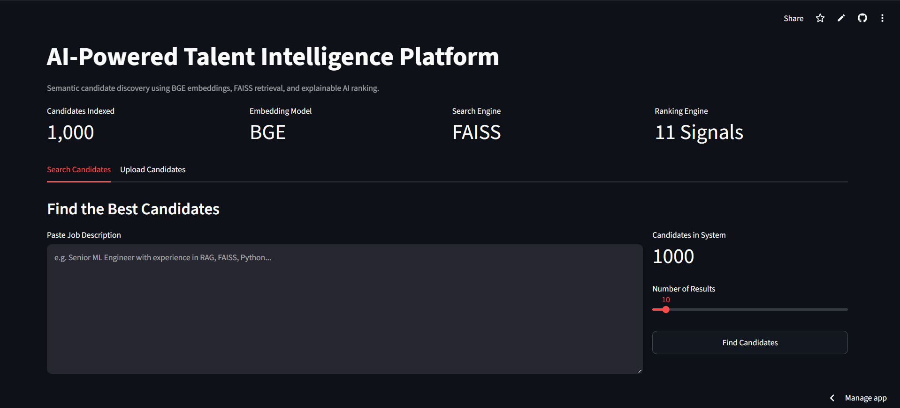
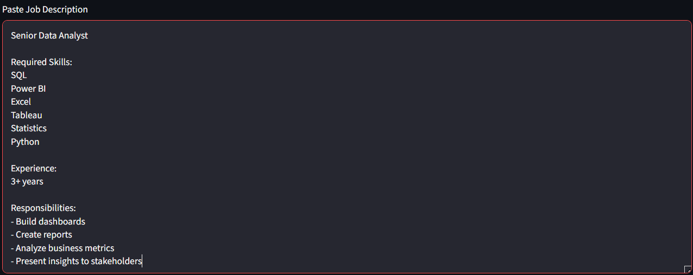
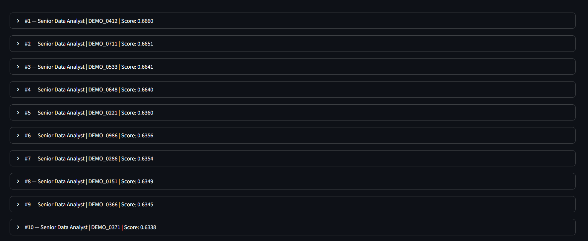
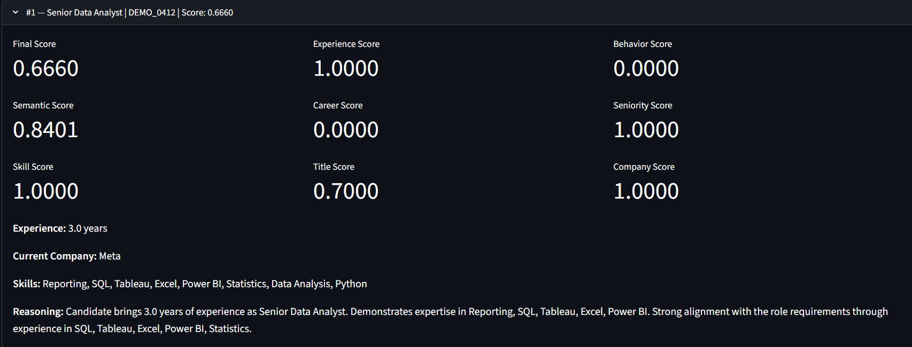
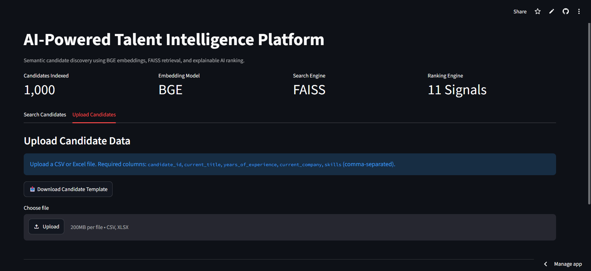
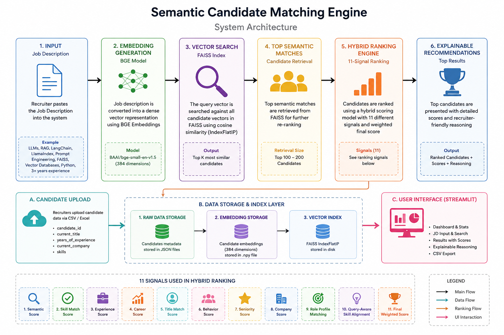

# Semantic Candidate Matching Engine

AI-powered talent intelligence platform for semantic candidate discovery, hybrid ranking, and explainable hiring recommendations.

## Live Demo

**Streamlit Application**  
https://semantic-candidate-matching-engine-uxggpfryj2kq3kta4bxawr.streamlit.app/

**GitHub Repository**  
https://github.com/reddyeswaranush/semantic-candidate-matching-engine

---

## Problem Statement

Traditional resume screening systems rely heavily on keyword matching, causing highly qualified candidates to be overlooked when their profiles use different terminology.

This project uses semantic search, vector retrieval, and hybrid ranking to identify the most relevant candidates based on meaning rather than exact keyword matches.

---

## Features

- Semantic candidate search using BGE embeddings
- FAISS vector similarity retrieval
- Hybrid 11-signal ranking engine
- Query-aware role detection
- Explainable candidate reasoning
- Candidate upload via CSV or Excel
- Automatic embedding generation
- Automatic FAISS index rebuilding
- Recruiter-friendly Streamlit dashboard
- CSV export for shortlisted candidates

---

## Project Metrics

- Supports 100,000+ candidate profiles
- 384-dimensional BGE embeddings
- FAISS cosine similarity retrieval
- 11-signal hybrid ranking engine
- Explainable AI-powered recommendations
- Cloud deployment using Streamlit

---

# Screenshots

## Dashboard Overview

The recruiter dashboard provides a summary of the candidate database, embedding model, retrieval engine, and ranking system.



---

## Candidate Search

Recruiters can paste a job description and configure the number of results to retrieve.



---

## Search Results

The platform retrieves the most relevant candidates using semantic search and hybrid ranking.

Features demonstrated:

- Semantic retrieval using BGE embeddings
- FAISS vector similarity search
- Hybrid ranking engine
- Top candidate recommendations



---

## Candidate Analysis

Each candidate receives a detailed breakdown of ranking signals and explainable reasoning.

Metrics include:

- Final Score
- Semantic Score
- Skill Match Score
- Experience Score
- Career Score
- Seniority Score
- Company Score



---

## Candidate Upload Workflow

Recruiters can upload candidate profiles using CSV or Excel files. The system automatically generates embeddings and rebuilds the FAISS index.



---

## Project Structure

```text
semantic-candidate-matching-engine/
│
├── app.py
├── src/
│   ├── full_embeddings.py
│   ├── full_retrieval.py
│   ├── ranking.py
│   ├── reasoning.py
│   ├── storage_manager.py
│   └── candidate_upload.py
│
├── assets/
├── data/
├── storage/
└── requirements.txt
```
---

## System Architecture



### Candidate Retrieval Pipeline

```text
Recruiter Job Description
            │
            ▼
    BGE Embeddings
            │
            ▼
   FAISS Vector Search
            │
            ▼
 Top Semantic Candidates
            │
            ▼
 Hybrid 11-Signal Ranking
            │
            ▼
 Explainable Recommendations
```

---

## Tech Stack

### Machine Learning

- BAAI/bge-small-en-v1.5
- Sentence Transformers
- NumPy

### Vector Search

- FAISS IndexFlatIP
- Cosine Similarity Search

### Backend

- Python
- JSON Storage Layer

### Frontend

- Streamlit

### Data Processing

- Pandas
- OpenPyXL

---

## Candidate Search Pipeline

### Step 1: Candidate Upload

Recruiters upload candidate data through CSV or Excel files.

Required fields:

- candidate_id
- current_title
- years_of_experience
- current_company
- skills

### Step 2: Embedding Generation

Each candidate profile is transformed into a semantic representation using BGE embeddings.

Output:

- 384-dimensional embedding vector

### Step 3: Vector Indexing

Candidate embeddings are stored inside a FAISS vector index for efficient retrieval.

### Step 4: Semantic Retrieval

The job description is embedded and matched against candidate embeddings using cosine similarity.

### Step 5: Hybrid Ranking

Candidates are ranked using:

- Semantic Score
- Skill Match Score
- Experience Score
- Career Score
- Title Match Score
- Behavior Score
- Seniority Score
- Company Score
- Role Profile Matching
- Query-Aware Skill Alignment
- Final Weighted Ranking

### Step 6: Explainable Recommendations

Each recommendation includes recruiter-friendly reasoning explaining why the candidate was selected.

---

## Example Use Cases

### Machine Learning Hiring

- Python
- Machine Learning
- NLP
- FAISS
- RAG
- PyTorch

### Generative AI Hiring

- LLMs
- RAG
- LangChain
- LlamaIndex
- Prompt Engineering
- Vector Databases

### Data Analytics Hiring

- SQL
- Power BI
- Tableau
- Excel

### Backend Hiring

- Python
- Java
- Docker
- Kubernetes
- PostgreSQL

---

## Deployment

The application is deployed on Streamlit Cloud and supports:

- Candidate upload
- Semantic retrieval
- FAISS indexing
- Explainable ranking
- CSV export

---

## Future Improvements

- Multi-company workspaces
- PostgreSQL storage backend
- Candidate profile enrichment
- LLM-powered recruiter summaries
- Analytics dashboard
- API integrations
- Authentication and role-based access control

---

## Author

### Reddy Eswar Anush

B.Tech Computer Science and Engineering  
National Institute of Technology Agartala

**GitHub**  
https://github.com/reddyeswaranush

**LinkedIn**  
https://www.linkedin.com/in/reddy-eswar/

**Project Repository**  
https://github.com/reddyeswaranush/semantic-candidate-matching-engine

**Live Demo**  
https://semantic-candidate-matching-engine-uxggpfryj2kq3kta4bxawr.streamlit.app/
